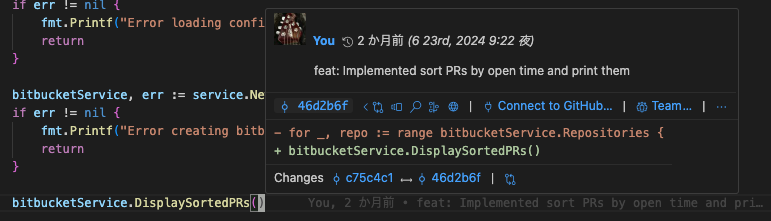
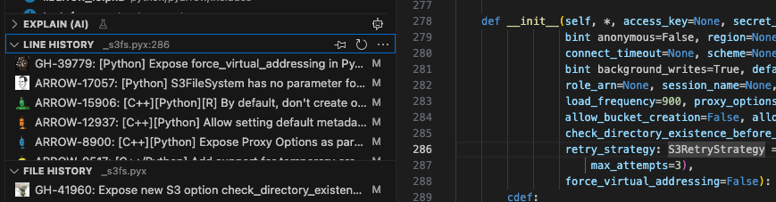

- [任意の行のコミットメッセージや変更履歴を確認する](#任意の行のコミットメッセージや変更履歴を確認する)
  - [VSCode拡張機能のGitLensを使用する](#vscode拡張機能のgitlensを使用する)
  - [git blame](#git-blame)
- [コミットの再編集](#コミットの再編集)
  - [amend commit](#amend-commit)
    - [最新コミットに追加や修正](#最新コミットに追加や修正)
  - [interactive rebase](#interactive-rebase)
    - [最新コミットより前のコミットに修正を入れ込みたい場合](#最新コミットより前のコミットに修正を入れ込みたい場合)
    - [最新コミットより前のコミットのコミットメッセージを修正する](#最新コミットより前のコミットのコミットメッセージを修正する)
    - [すでにコミット済みの複数のコミットをまとめる](#すでにコミット済みの複数のコミットをまとめる)
  - [rebase中になんか変なことになった場合](#rebase中になんか変なことになった場合)
- [merge先のブランチの反映をrebaseで行う方法](#merge先のブランチの反映をrebaseで行う方法)


# 任意の行のコミットメッセージや変更履歴を確認する

## VSCode拡張機能のGitLensを使用する
- コミットメッセージのインライン表示機能




- Line History機能




## git blame
- コマンド or ブラウザ(GitHub, Bitbucket)でgit blameを使って確認

# コミットの再編集

コミットの再編集全般の注意点：

- コミットの履歴を書き換える行為は、他の人がpullしている可能性がある場合には、基本的には非推薦
    - 特に、PR提出後は非推薦（コミットハッシュが変わるのでPRコメントに書いたリンクが古いものを指し続けていたり、他の人がpullしている可能性があるため）
- リモートにpush済みのコミットを再編集した後は強制pushが必要
    - 共有ブランチにおいては--forceよりも--force-with-lease推薦
    - --force: 無条件に強制pushを行うため、共有ブランチにおいては気付かずに他の人の作業を上書きする危険性が有る
    - --force-with-lease: pushする前にリモートブランチの状態をチェックする。他の誰かが同じブランチに新しいコミットをpushしていた場合、pushは失敗する。そのため共有ブランチにおいては--forceより安全性が高く推薦される
    - 共有ブランチの場合は、そもそも--force-with-leaseを使う場合も他メンバーに通知した方が良い


## amend commit

### 最新コミットに追加や修正

1. 入れ忘れた内容をstagingする
2. git commit --amendでコミットする
3. git pushする(一つ前のコミットがリモートにpush済みだった場合は強制pushが必要)

## interactive rebase

### 最新コミットより前のコミットに修正を入れ込みたい場合

interactive rebaseを使用する。

1. 以下のような履歴が有って、「減算機能の追加」のコミットに修正を入れ込みたいとする

```text
(HEAD -> feature/xxx)docs: ドキュメント更新
feat: 乗算機能の追加
feat: 減算機能の追加
feat: 加算機能
```

2. 適当なコミットメッセージ(tmpとする)で、入れ込みたい修正をコミットする

```text
(HEAD -> feature/xxx) tmp
docs: ドキュメント更新
feat: 乗算機能の追加
feat: 減算機能の追加
feat: 加算機能
```

3. interactive rebaseを開始する

最新コミットを1とすると「減算機能の追加」は4つ目なので、HEAD~4と指定する

```bash
git rebase -i HEAD~4
```

4. エディタが開き、以下のような内容が表示される

```text
pick ghi9101 減算機能の追加
pick def5678 乗算機能の追加
pick abc1234 ドキュメント更新
pick edf6789 tmp
```

5. tmpコミットを「減算機能の追加」コミットの直後に移動し、pickをfixup(またはf)に変更し、(vimの場合):wqで保存して終了

```text
pick ghi9101 減算機能の追加
fixup edf6789 tmp
pick def5678 乗算機能の追加
pick abc1234 ドキュメント更新
```

6. rebase完了(コミットメッセージは統合元のコミットメッセージのまま)

「減算機能の追加」〜「ドキュメント更新」のコミットハッシュは変わっている。

```text
(HEAD -> feature/xxx)docs: ドキュメント更新
feat: 乗算機能の追加
feat: 減算機能の追加
feat: 加算機能
```

7. pushする際は、リモートにpush済みのものに対しrebaseした場合は強制pushする必要が有る

```text
git push --force origin feature/xxx
```

ちなみにfixupではなくeditやsquashでも出来る。
- edit(e): rebase中に該当ファイルを修正する
- squash(s): fixupと同じで複数のコミットを統合するが、新しいコミットメッセージに編集できる

### 最新コミットより前のコミットのコミットメッセージを修正する
- rebaseの画面で、修正したいコミットのpickをrewordに変更して保存すると再度エディタが開きコミットメッセージを修正出来るようになる。修正したら保存して終了する。
- 修正したいのが最新コミットであれば何もstagingせずにgit commit --amendで修正可能

### すでにコミット済みの複数のコミットをまとめる

- 上記「最新コミットより前のコミットに修正を入れ込みたい場合」の例とやることは同じ。fixupやsquashでまとめる

## rebase中になんか変なことになった場合

以下のコマンドで進行中のrebaseプロセスをキャンセルし、rebase開始前の状態に戻せる。

```bash
git rebase --abort
```

- rebase中にコンフリクトが発生し、解決が難しい場合
- rebaseの結果が予期せぬものになり、最初からやり直したい場合
- rebaseを間違って開始してしまった場合

# merge先のブランチの反映をrebaseで行う方法

mergeではなくrebaseで行う方法を説明する。

以下の例では、開発ブランチがfeature/xxx, merge先がdevelopとする。

1. developのローカルリポジトリを更新

```bash
git checkout develop
git pull
```

2. feature/xxxで、rebaseを実行

```bash
git checkout feature/xxx
git rebase develop
```

3. コンフリクトがある場合は解決する

- ファイルを編集してコンフリクトを解決
- 解決したファイルをgit addでstaging
- git rebase --continueでrebaseを継続

4. rebaseが完了したら必要に応じて強制push

```bash
git push --force origin feature/xxx
```

参考：
- [Merging vs rebasing - Atlassian](https://www.atlassian.com/ja/git/tutorials/merging-vs-rebasing)
- [03_コーディングのtips.md#merge先のブランチの変更を反映するのにmergeではなくrebaseを検討する](./03_コーディングのtips.md#merge先のブランチの変更を反映するのにmergeではなくrebaseを検討する)
